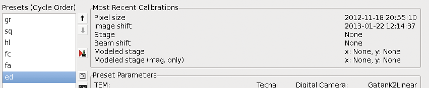

## No calibration Error during targeting.

Targeting in Leginon uses the calibration of the move type but with the calibration of the parent image (the image that you select the target on). One exception is "Image Shift" Calibration which use the calibration of both the parent and the target acquisition presets. The calibrations done at a particular preset are displayed in Presets Manager Node.

When Leginon complains that there is no calibration,

1.  close the current MSI application
2.  restart Leginon (and its clients) if needed
3.  run the [Calibration Application](/leginon/Leginon_Manual/Leginon_Calibrations_Application)
4.  Find the required calibration instruction and follow it, starting from sending the preset with the missing calibration to the scope.

## Matrix calibration fails

*Display correlation map in the matrix calibration node during the calibration can help identify the source of the failure.

Observations and Why:

-   The image appears normal with most pixels in medium gray but the correlation images show peaks moving randomly during the calibration - No image contrast for correlation due to no object in view, at Gaussian focus, or bad image intensity either too low or too high

-   One or both images appear white or black and the correlation images show peaks moving randomly during the calibration - Artifacts in the images such as spikes not corrected by the corrector node that fool the correlation procedure to consider the image is never moved or moved a lot.

-   The correlation image give consistent multiple peaks or bars - Bright/Dark correction images are not created.

-   Both images and correlation peaks behave normally, i.e., there is one correlation peak and its location corresponds well to the movement seen in the images and the set shift fraction - Pixel calibration may be off.

Solutions:

-   No object in view
     
    -   EM> move the specimen holder to an area with an isotropic feature well centered within the CCD.

-   No constrast
     
    -   Leginon/Presets Manager> Adjust defocus, and/or exposure time of the preset that the calibraion uses and send the new values to scope.

-   Spikes in the image
     
    -   Leginon/Presets Manager> Reduce exposure time? Might reduce number of random event
         
    -   Leginon/Correction/Settings> Select the camera configuration of the problem image.
         
    -   Leginon/Correction/Settings> Reduce the despike threshold and/or increase the neighborhood size. The aim is to allow spikes with lower values and larger footprint, respectively, to be removed.

-   No bright/dark images
     
    -   Leginon/Correction/Settings> Select the camera configuration of the problem image.
         
    -   Leginon/Correction> Acquire bright/dark images

-   Pixel Calibration is off
     
    -   Leginon/Matrix/Settings> Increase Tolerance to allow the error to pass through.
         
    -   Leginon/Matrix> redo the calibration. If it is successful, test the calibration in Navigation
         
    -   If the calibration test is satisfactory, the result is acceptable. Pixel calibration can be off since it is only an estimate for lower mags. You may want to modify the pixel calibration entry according to the calculated value in matrix calibration. Leaving the value as is will not cause major problem.

## Beam shift matrix calibration fails

-   Other than the failures common for all matrix calibraion, there are some additional reasons for beam shift calibration to fail.

Observations and Why:

-   The images shows not just a circle of the beam but a treak - The beam is too intense that the CCD picks up the movement of the beam when the beam shutter is opened and closed.

-   The second images shows a shadow of the first- The CCD is saturated from the first image acquisition.

-   Not the whole image moves during the beam shift - This calibration have to see only the beam not grid bars or objects on the grid . Neither of the latter will move when the beam is shifted and therefore will show as false peak in the correlation image.

-   Part of the beam moves out of the view during beam shift - The applied shift or the beam too large.

Solutions:

-   Intense beam, saturated CCD
     
    -   EM> reduce the intensity by a change in spot size.
         
    -   Leginon> reduce the binning so that the exposure time can be increased without saturating the camera. The longer exposure also reduces the relative contribution of the shutter effect.

-   Unmoved object
     
    -   EM> move to an empty square.
         
    -   EM> If not possible to exclude the grid bars in the empty square at low magnifications, pull out the holder by about 3 cm (1 inch) and park it with a spacer during the calibration.

-   Beam shift too large
     
    -   Leginon/Matrix/Settings> Reduce shift fraction.

-   Beam too large
     
    -   EM> Reduce the beam size.
         
    -   Leginon/Matrix> Acquire test images and adjust exposure time, beam spot size etc. to match.

[< Troubles with Focusing and Drift Check](/leginon/Leginon_Manual/Trouble_shooting/Troubles_with_Focusing_and_Drift_Check) | [Troubles with Tomography >](/leginon/Leginon_Manual/Trouble_shooting/Troubles_with_Tomography)
