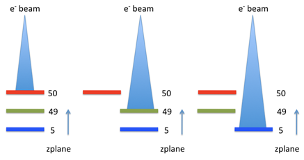

The changes from v2.1 DOES require upgrade at the microscope

See [Installation Troubleshooting](/leginon/Leginon_Manual/Installation_Troubleshooting) and [Leginon Bulletin Board](http://emg.nysbc.org/redmine/projects/leginon/boards) searching
for "install" if you run into problems.

## Packages required from NRAMM

All Leginon (and Appion) packages distributed from NRAMM are under one svn control.

Recommended minimal subpackage upgrade:
|pyscope|change in configuration|
|pyami|new function related to configuration search|
|leginon|change in configuration reading|
|sinedon|change in configuration reading|

## Download myami-2.2 source code

### Check out SVN Source Files from the repository

Assuming that you have installed some kind of svn client such as TortoiseSVN "http://tortoisesvn.tigris.org/", you can use your mouse to do the following

-   Create myami2.2 directory somewhere at your convenience
-   Change directory into myami2.2
-   Right-click the mouse botton in this directory window and select Tortoise svn
    Checkout in the menu: 
-   Set up svn checkout window like this, but check out from http://emg.nysbc.org/svn/myami/branches/myami-2.2 and save it to myami2.2 folder 

Otherwise, you can copy the files from your linux myami-2.2 source.

## Perform system check if you can't remember where you have installed your Leginon before.

-   Go to ~/myami2.2/leginon
-   Double click on syscheck.py

You should have all the supporting packages installed for v2.1. If you see any lines like "* Failed...", then you have something missing. Otherwise, everything should result in "OK".

## Move your existing packages to a backup directory (Optional):

At the beginning of the syscheck.py output, the location of the exisiting Leginon folder is shown. Although new installation overwrite the old in most cases, problem has been observed in the past. Therefore, it is best to remove the old files from the path before new installation. Better yet, copy into a backup folder because we need some configuration files from them.
You may find these folders here:
|leginon|
|pyscope|
|sinedon|
|pyami|

For example, your Leginon folder is at C:\python25\Lib\site-packages\leginon

    Go to C\python25\site-packages
    Create Leginon2_1_backup folder
    Move Leginon folder into Leginon2_1_backup folder

## Install subpackages you downloaded from NRAMM svn repository. **You should not install numextension, libcv and comarray using this instruction**

-   Start a command line Window from Start Menu

-   Reinstall the package in EACH of the following folders using the included setup.py
    |leginon|
    |pyscope|
    |sinedon|
    |pyami|

    cd Your_Download_Place\myami2.2_folder
    c:\python25\python.exe setup.py install

## copy the old config files to the new location.

**If you want to avoid copying cfg files to new installation in the future, copy them from where you had it in the 2.1 backup to the global config directory**

## Locate global configuration directory following standard on Windows

Saving cfg files in a global location reduces future need for copying old configuration to updated installation. The location is different for different versions of Windows. To locate the one for your Windows version:

1. go to C:\python27\Lib\site-packages\leginon
2. run configcheck.py

The script gives the three search directories of the cfg files and the loaded file if present. Note the first search directory that with a name most likely start with **C:\Programs** and ends with **\myami**. This is the **global configuration directory** we will use.

  ----------------- ------------------------------------------------------------------
  *config file*     likely location in 2.1 installation if not in your hoe directory
  sinedon.cfg       C:\python25\Lib\site-packages\sinedon_2.1_backup
  leginon.cfg       C:\python25\Lib\site-packages\leginon_2.1_backup\config
  instruments.cfg   C:\python25\Lib\site-packages\pyscope_2.1_backup
  ----------------- ------------------------------------------------------------------

## modify Tietz PXL camera imaging size if you did so before for Leginon 2.2

**You should not copy the old one in this case since the file has been changed**

-   Go to C:\Python25\Lib\site-packages\pyscope

-   Edit tietz.py with a plain text editor

-   Find the lines:

     def getCameraSize(self):
    # {'type': dict, 'values': {'x': {'type': int}, 'y': {'type': int}}}}
    x = self._getParameterValue('cpTotalDimensionX')
    y = self._getParameterValue('cpTotalDimensionY')
    return {'x': x, 'y': y}

-   Change the last line to:

        return {'x': 2048, 'y': 2048}

## About [TEM Scripting Beam Tilt Calibration](/leginon/Leginon_Manual/Instrument_Set-up/Calibrations_required_on_FEI_microscopes/TEM_Scripting_Beam_Tilt_Calibration)

-   If you have done [TEM Scripting Beam Tilt Calibration](/leginon/Leginon_Manual/Instrument_Set-up/Calibrations_required_on_FEI_microscopes/TEM_Scripting_Beam_Tilt_Calibration) and have changed the scale factor in tecnai.py, you should copy the value to your new installation.

## Modify pyscope/instruments.cfg

Starting from 2.2, Cs values are saved with the scope in instruments.cfg that need to match the value saved in the database. Also a z-plane needs to be assigned to each camera

### TEM

**cs is the coefficient of spherical aberration in meters**. Find out from TEM manufacture the proper value for your tem.
For example

[tem]
class: fei.Tecnai
cs: 2.0e-3

### Camera

**height and width are number of pixels based on the orientation presented in Leginon image viewer**

- Some Tietz camera may have an odd physical dimension. Use TCL/EMMenu program to find out the good dimension used in Tietz's own software and entered in this configuration.

For example

[camera]
class: gatan.Gatan
zplane: 50
height: 4096
width: 4096

**zplane is a number that gives the order of camera**. If a camera with low zplane value is going to acquire an image, Leginon will attempt to retract all cameras at higher zplane values.

**HEIGHT and WIDTH are not shown in these examples for simplicity**

- One computer for both tem and digital camera:
[tem]
class: fei.Tecnai
cs: 2.0e-3
[camera]
class: gatan.Gatan
zplane: 50

- Separate computers for the two instruments: configure only the instrument reside on the particular computer
- On the computer that controls the tem:
[tem]
class: fei.Tecnai
cs: 2.0e-3
- On the computer that controls the digital camera:
[camera]
class: gatan.Gatan
zplane: 50

- Two camera at the same plane:
- On the computer that controls the digital camera:

DE12 and DE Survey camera are retract/extend together, with the survey camera at off-axis. Therefore zplane should be set at the same value
For example,

[camera1]
class: de.DE12
zplane: 50

[camera2]
class: de.DESurvey
zplane: 50

- Gatan Orius camera that is installed typically with Gatan K2/Falcon camera is technically on the same plane but is not capable of insertion unless K2 is retracted. On the other hand, K2 camera insertion includes a retraction of Orius at lower level of the function call in DM. Therefore, Orius is considered as a camera at lower zplane.
[camera1]
class: dmsem.GatanK2Base
zplane: 50

[camera2]
class: dmsem.GatanOrius
zplane: 49

[< How to Update from v2.1 (Linux)](/leginon/Leginon_Manual/Upgrade_Instructions/Upgrade_to_Leginon_System_version_22_from_version_21/How_to_Update_from_v21_Linux) | [Check Cs value match before using Leginon after upgrade >](/leginon/Leginon_Manual/Upgrade_Instructions/Upgrade_to_Leginon_System_version_22_from_version_21/Check_Cs_value_match_before_using_Leginon_after_update)
