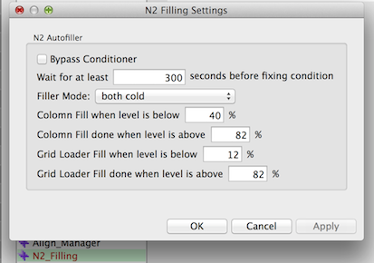

AutoFiller on Krios fills the liquid nitrogen in the column and/or Autoloader at a set level. During the filling, the vibration of specimen prevents best data collection.

A new node aliased "N2 Filling" exists in 3.1 version of MSI applications to monitor the liquid nitrogen level. If the nitrogen level in either column or autoloader is below the threshold defined, it will pause final image acquisition, trigger the refill, and wait until refill is completed before resuming data collection.

If you are running such MSI application on Krios, set up "N2 Filling" like this:

This setting example assumes that both autoloader and column needs to be cooled.

Filling starts when the level is detected to be below the indicated level. In this standard condition, both column and grid loader nitrogen are filled when either one has a low level.

Depending on the version of the TEM Scripting available to you, Leginon either detect whether the filler is busy and resume data collection when it is not, or monitor the nitrogen level, and wait until both level are above the high threshold.

To deactivate the autofiller triggering, activate "Bypass Conditioner"
