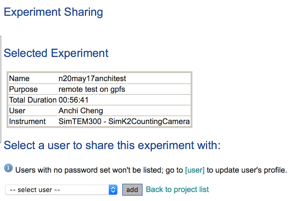

-   At http://yourhost/myamiweb/getprojects.php, click on the name of the project to be
    edited.

or click on the project name in the session summary page

-   Find the session you want to share, and click on the column for Sharing. The text normally says No in that column to mean that the session
    is currently not shared. It should bring up a page similar to this:

-   Select the user you want to share the experiment with, and click "Add"

[< Grid management](/leginon/Leginon_Manual/Using_Project_Management_Tools/Grid_management)
