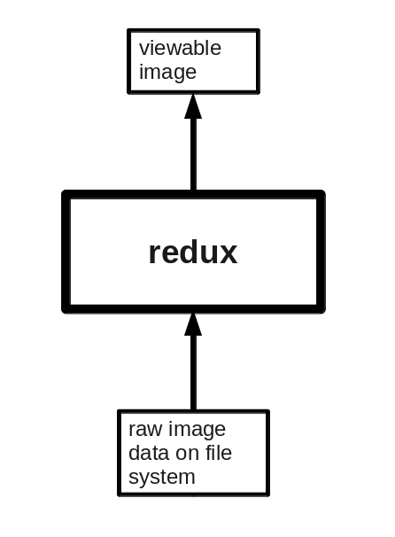

redux is a package for generating custom views of images

## Current design

## Features

* python library

    import redux.client
    c = redux.client.SimpleClient()
    j = c.process_kwargs(filename='example.png', oformat='JPEG')

* network daemon that can answer requests for an image and the pipeline of processing to do on it

    reduxd

* command line client that uses either the network daemon or locally imported python library to do processing

    redux --filename=example.png --oformat=JPEG > example.jpg
    redux --server_host=localhost --filename=example.png --oformat=JPEG > example.jpg

-   cache: most buggy part

## [Using Redux to serve images on myamiweb](/leginon/Redux/Using_Redux_to_serve_images_on_myamiweb)
